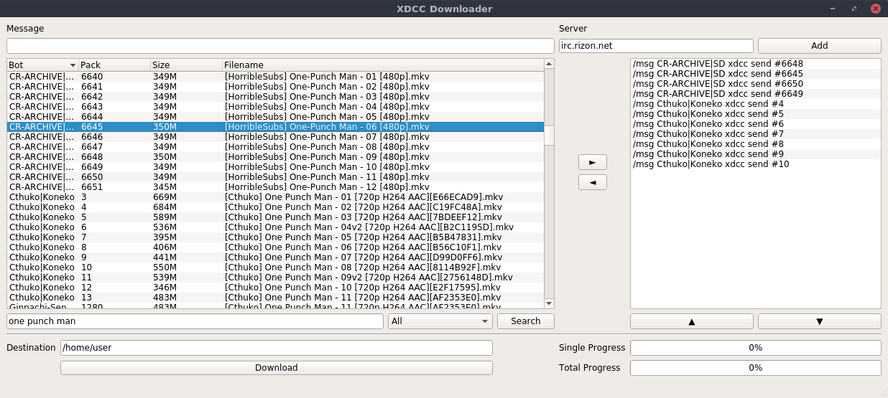
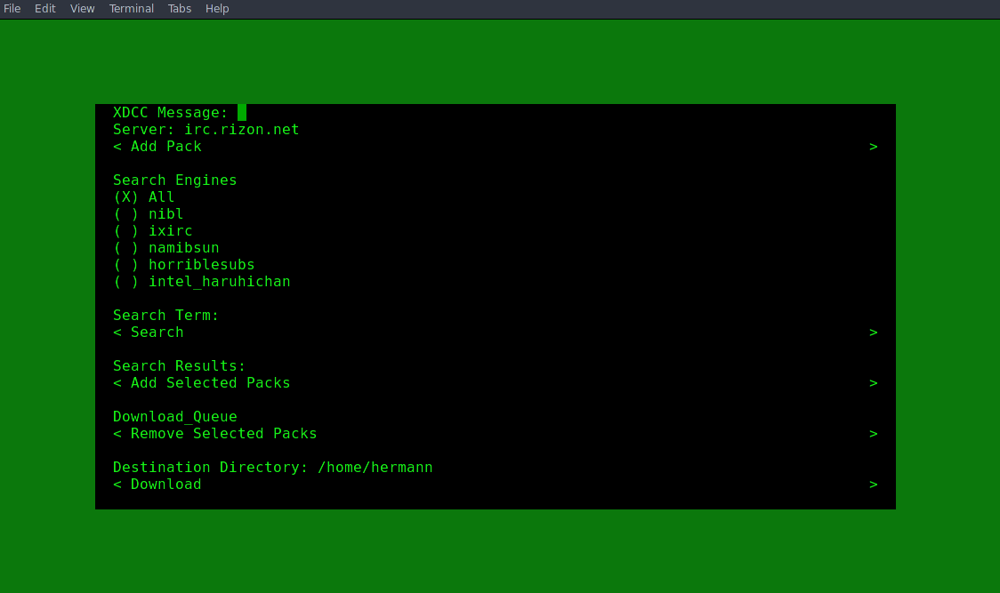

# XDCC Downloader

|master|develop|
|:---:|:---:|
|[](https://gitlab.namibsun.net/namboy94/xdcc-downloader/commits/master)|[](https://gitlab.namibsun.net/namboy94/xdcc-downloader/commits/develop)|


An XDCC File downloader based on the [irclib](https://github.com/jaraco/irc) framework.

## Installation

### Via Pip (Preferred):

**As User (Preferred)**

    $ pip install xdcc_dl --user
    
**Systemwide**

    # pip install xdcc_dl
    or
    $ sudo pip install xdcc_dl
    
### Via setup.py

**As User (Preferred)**

    $ python setup.py install --user
    
**Systemwide**

    # python setup.py install
    or
    $ sudo python setup.py install
    
    
### Binaries

The supplied binaries at the [Github Releases](https://github.com/namboy94/xdcc-downloader/releases) page
do not require installation nor any dependencies. They can simply be executed.


## Usage

### Message-based CLI

XDCC Packlists usually list xdcc commands in the folowing form:

    /msg <BOTNAME> xdcc send #<PACKNUMBER>
    
By supplying this message as a positional parameter, the pack can be downloaded.

**Examples:**

    # This is the xdcc message:  '/msg the_bot xdcc send #1'
    
    # This command downloads pack 1 from the_bot
    $ xdcc_dl "/msg the_bot xdcc send #1"
    
    # It's possible to download a range of packs (1-10 in this case):
    $ xdcc_dl "/msg the_bot xdcc send #1-10"
    
    # Range stepping is also possible:
    $ xdcc_dl "/msg the_bot xdcc send #1-10,10"
    # (This will download packs 1,3,5,7,9)
    
    # you can also specify the destination file or directory:
    $ xdcc_dl "/msg the_bot xdcc send #1" -d /home/user/Downloads
    # The destination defaults to your current working directory
    
    # if the bot is on a different server than irc.rizon.net, a server
    # has to be specified:
    $ xdcc_dl "/msg the_bot xdcc send #1" --server irc.freenode.org
    
    # You can also specify an IRC username. If none was supplied, a
    # random string of numbers will be used instead
    $ xdcc_dl "/msg the_bot xdcc send #1" --user Me
    
    # To specify how verbose the program is, you can pass the
    # verbosity parameter as a number between 0 and 6:
    $ xdcc_dl "/msg the_bot xdcc send #1" --verbosity 3
    
### GUI

By calling the program with the ```-g``` flag (or without arguments on Windows)
a graphical user interface is started. It offers searching for packs using various
web scrapers or adding packs manually like with the CLI, adding these packs
to a download queue and then downloading these queued packs.


    
### TUI

Similar to the GUI, a textual user interface can be used by calling the program
in conjunction with the ```-t``` flag.



### As a library:

xdcc-downloader is built to be used as a library for use in other projects.
To make use of the XDCC downloader in your application, you will first need to
create a list of [XDCCPack](xdcc_dl/entitites/XDCCPack.py) objects, either by hand
or by using the [PackSearcher](xdcc_dl/pack_searchers/PackSearcher.py). 

Once this list of XDCCPacks is created, use one of the following classes:

* [XDCCDownloader](xdcc_dl/xdcc/XDCCDownloader.py), if you can guarantee that every pack is on the same server
* [MultipleServerDownloader](xdcc_dl/xdcc/MultipleServerDownloader), if the packs are on different IRC servers

Do not use any classes in ```xdcc_dl.xdcc.layers```, those all work in tandem to create these two higher-level
classes.

Both classes are initialized using the following parameters:

**user**:  Either a string, or a [User](xdcc_dl/entitites/User.py) object which specifies
           the username for connecting to the IRC network.
           A random username can be generated when passing 'random' as the username
           
**logger**: Either pass an integer value between 0 and 6 to set the verbosity,
            a [Logger](xdcc_dl/logging/Logger.py) object or another object of
            a class that implements all of Logger's methods.

Once initialized, start the XDCC downloads by passing the list of XDCCPacks
to the downloader's download() method.

A second optional Parameter is the progress. This parameter is an instance of the
[Progress](xdcc_dl/entitites/Progress.py) class and can be used to see the progress of
the downloads from a different point in the application
    
## Projects using xdcc-downloader

* [toktokkie](https://gitlab.namibsun.net/namboy94/toktokkie)
   
## Further Information

* [Changelog](https://gitlab.namibsun.net/namboy94/xdcc-downloader/raw/master/CHANGELOG)
* [Gitlab](https://gitlab.namibsun.net/namboy94/xdcc-downloader)
* [Github](https://github.com/namboy94/xdcc-downloader)
* [Python Package Index Site](https://pypi.python.org/pypi/xdcc_dl)
* [Documentation(HTML)](https://docs.namibsun.net/html_docs/xdcc_downloader/index.html)
* [Documentation(PDF)](https://docs.namibsun.net/pdf_docs/xdcc_downloader.pdf)
* [Git Statistics (gitstats)](https://gitstats.namibsun.net/gitstats/xdcc_downloader/index.html)
* [Git Statistics (git_stats)](https://gitstats.namibsun.net/git_stats/xdcc_downloader/index.html)
* [Test Coverage](https://coverage.namibsun.net/xdcc-downloader/index.html)
